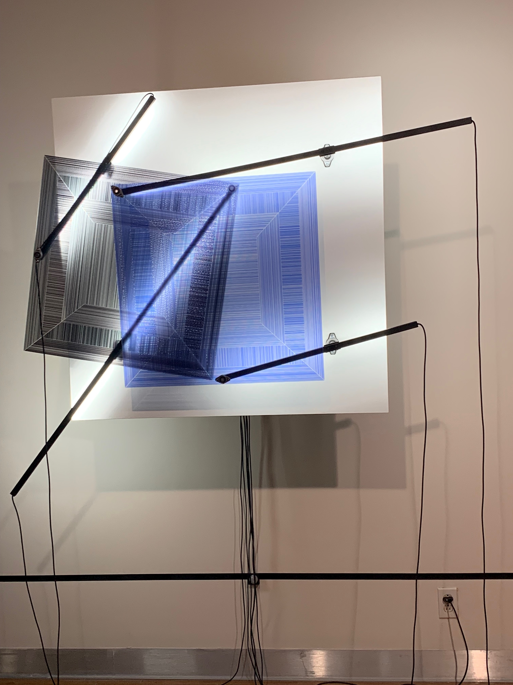

# Titre de l'oeuvre ou de la réalisation
Mécanisme de dessaisissement

#  Nom de l'artiste ou de la firme
Béchard Hudon
# Année de réalisation
2019-2021
# Nom de l'exposition ou de l'événement
Configuration du sensible
 # Lieu de mise en exposition
Salle Alfred-Pellan
# Date de votre visite
16 mars 2022
 # Description de l'oeuvre ou du dispositif multimédia (à composer ou reprendre la description offerte sur le site de l'artiste ou le cartel de l'exposition en citant bien sa source)
Il a trois formes géométriques, un carré, un cercle et un triangle, divisé en plusieurs morceaux de la même forme qui bougent ensemble pour créer un effet semblable à une illusion d'optique. Ces formes sont activées par des mécanismes pour les faire bouger, qui s'activent seulement lorsqu'on se place en avant d'eux.
 # Explications sur la mise en espace de l'oeuvre ou du dispositif 
L'oeuvre est placée sur le premier mur à la gauche quand on entre. Elle est appart du reste de la salle et n'occupe pas beaucoup de place puisqu'elle est accrochée sur un mur et elles est plutôt mince. Il y a du mouvement rotatif dans cette oeuvre, ce qui donne un effet étrange de mouvement d'illusion quand on regarde façe à l'oeuvre.

 # Liste des composantes et techniques de l'oeuvre ou du dispositif (ex. : réalité virtuelle, projecteurs, caméra USB, anneau lumineux...)
Pour les composantes, il y a du bois, de l'aluminium, de l'impression à jet d'encre sur acrylique, des diodes électrolumimnescentes, des systèmes électromécaniques, des détecteurs de mouvement, et de l'alimentation de courant. Le dispositif sont des tiges de métals qui tiennent des formes géométriques de différentes couleurs et il y a de la lumière.
 # Liste des éléments nécessaires pour la mise en exposition (ex. : crochets, sac de sable, câbles de soutien...)
Avoir de l'espace pour les placer, avoir un mur assez robuste pour soutenir le poid de l'oeuvre, et de l'électricité.
 # Expérience vécue :
J'ai bien aimé le visuel des ces oeuvres puisque c'était vraiment beau et aéré, mais le problème était que je n'avais pas remarqué que l'oeuvre formait une illusion d'optique alors j'étais un peu confu, je me demandais quel était le but de cette oeuvre mais j'ai compris plus tard quand quelqu'un me l'a expliqué. J'ai bien aimé tout de même.
 # Description de votre expérience de l'oeuvre ou du dispositif, de l'interactivité, des gestes à poser, etc.
J'aime bien l'oeuvre, mais je trouve qu'il n'y a pas grand chose à faire appart le fait de le regarder agir.
 # ❤️ Ce qui vous a plu, vous a donné des idées et justifications
j'ai aimé le look moderne des formes avec la lumière, personellement je trouve que ça pourrait être une oeuvre dans une maison ultra moderne avec un style unique comme un extra que quelqu'un pourrait payer pour sa maison d'artiste.
 # 🤔 Aspect que vous ne souhaiteriez pas retenir pour vos propres créations ou que vous feriez autrement et justifications
j'ai bien aimé l'oeuvre en général, mais si je suis vraiment sévère, je dirais que l'oeuvre n'était pas assez interactive puisqu'on ne fait que la regarder.
